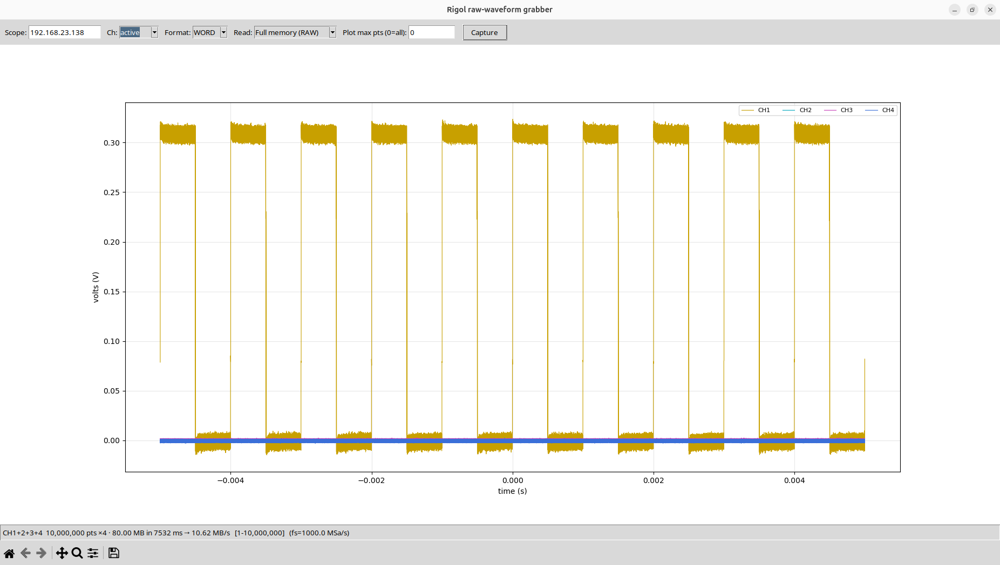
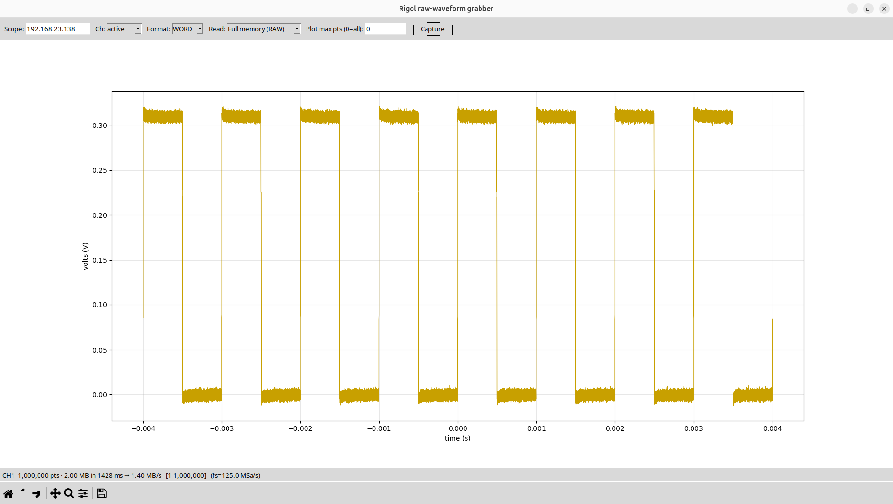
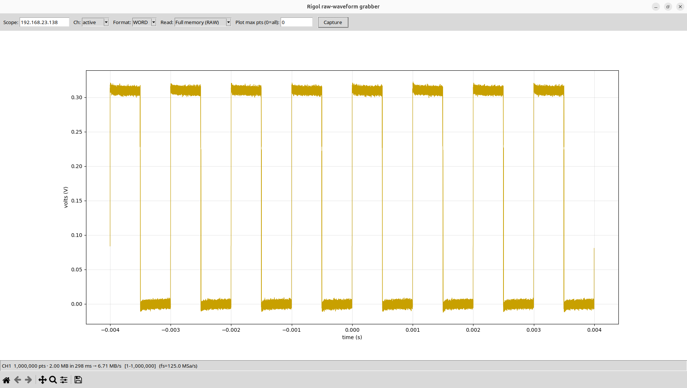

# mho-speed-patch

Tools and a working patch to speed up **raw waveform readout** on Rigol
MHO/DHO oscilloscopes (investigated on an **MHO934**, firmware `00.01.00`;
Rockchip RK3399 / Android).

The scope's `:WAVeform:DATA?` response is built one byte at a time into a
`std::vector<char>`, which caps deep-memory readout at ~1.4–2 MB/s regardless of
the transport. This repo documents how that was found and ships a runtime patch
that replaces the byte-by-byte build with a bulk `memcpy`, plus the host-side
tuning that stops the scope idling the wire — **4.8× on the same read** (1.40 →
6.71 MB/s at 1 Mpt) and up to **10.6 MB/s** on large multi-channel grabs, which
is 90% of 100 Mbit line rate. Byte-identical output, fully reversible.



*All four channels, 10 Mpt each — 80 MB in 7.5 s at 10.62 MB/s, which is 90% of
100 Mbit line rate. Unpatched, this scope reads a single channel at 1.4 MB/s.*

## Layout

| directory | what |
|-----------|------|
| **`patch/`** | make the scope fast |
| **`capture/`** | use the scope: grab and plot waveforms |
| **`bench/`** | measure it, and the utilities the investigation used |
| **`docs/`** | how the patch works, and how the bottleneck was found |

| file | what |
|------|------|
| **`patch/patch_scope.py`** | **one command from your PC**: connect, root, provision frida-server, inject, tune for a wired link, hold |
| `patch/run_patch.sh` | the same thing via the repo's `.venv` |
| `patch/mho_speed_patch.js` | the Frida patch (bulk-copy `toWord`/`toByte` + `append` memcpy) |
| `patch/apply_patch.py` | lower-level: attach the patch to an already-provisioned scope |
| **`capture/waveform_gui.py`** | tiny Tk + matplotlib GUI: grab every active channel's raw waveform, overlay them, show the transfer time / MB/s |
| `capture/rigol_mho.py` | dependency-free SCPI helper (LAN socket + USB-TMC) + CLI |
| `bench/bench.py` | readout benchmark (size sweep, HTTP-ceiling, recv-timeline) |
| `bench/loopbench.c` | **on-scope** loopback benchmark: pure on-device throughput with the network wire removed |
| `bench/` | investigation utilities: `probe.js`, `bench_append.cpp`, `loadgen.py` |
| **`docs/PATCHING.md`** | the working patch: what's slow, where, and how to apply it |
| **`docs/FINDINGS.md`** | full bottleneck investigation (profiling, dead ends, corrections) |

## Quick start

You need only `adb` (Android platform-tools) and Python on your PC, plus the
scope's IP. The scope exposes unauthenticated network ADB on port 55555 out of
the box, so there's nothing to enable on it.

```
pip install frida
python3 patch/patch_scope.py <scope-ip>
```

That's it. It connects over ADB, gets root, downloads and starts a matching
`frida-server` on the scope (cached after the first run), injects the patch,
**tunes the scope for a wired link**, and then **stays running** — leave the
window open while you capture. Press **Ctrl-C** (or `kill` it) to revert the
scope to stock behaviour.

The tuning is the second half of the speedup and only matters on Ethernet. The
patch makes the scope *marshal* fast; the tuning makes it *overlap* marshalling
with the send instead of alternating, so the wire stops idling:

* **TCP send buffer 110 KB → 4 MB.** The app `write()`s the response in 1 MiB
  chunks; with the stock 110 KB buffer every write blocks until the wire drains
  it, so the CPU can't start building the next chunk.
* **The readout threads get pinned to the A72 big cores** (cpu4-5). By default
  the scheduler leaves them migrating over the 1.4 GHz A53s while the GUI owns
  both 1.8 GHz A72s. GUI threads are left alone, so the UI stays responsive.

Both are in-memory, reverted on exit, and cleared by a reboot. `--no-tune` skips
them. On a 100 Mbit link this takes a 1 Mpt WORD read from ~5.3 to ~6.9 MB/s and
a 10 Mpt read to ~10.8 MB/s — 92% of line rate. See `docs/FINDINGS.md`
"Update 2".

* Nothing is written to the scope's firmware; the patch is in-memory only and
  also disappears on reboot.
* For best results read each record in **one large `:WAV:DATA?` request**, not
  many small chunks (~60 ms saved per avoided round-trip).
* `patch/apply_patch.py` is the lower-level path if you've already put
  `frida-server` on the scope yourself. See `docs/PATCHING.md`.

> **Note:** the patch reverts the moment `patch/patch_scope.py` disconnects
> (Frida unloads its hooks). A fire-and-forget variant that survives disconnect
> is planned — see `docs/PATCHING.md` "Persistent variant".

## See it: capture + plot a waveform

```
pip install numpy matplotlib
python3 capture/waveform_gui.py <scope-ip>
```

Set the scope up yourself (timebase, depth, trigger). Pick a format (WORD/BYTE)
and read mode (full memory / screen), hit **Capture**: it just **`:STOP`s the
scope and reads the range the scope has set** — it does *not* change your
timebase, memory depth, sweep or trigger. It scales each record with its own
preamble and plots volts vs time; the status line shows points, size,
**transfer time and MB/s**.

Run it before and after `patch/patch_scope.py` to watch the speedup live. Same
scope, same wired link, same 1 Mpt record on CH1:

| | |
|---|---|
|  |  |
| **stock** — 2.00 MB in 1428 ms → **1.40 MB/s** | **patched + tuned** — 2.00 MB in 298 ms → **6.71 MB/s** |

That is **4.8×** on an identical read. It is also short of the 11.8 MB/s the
wire can do, and that gap is not bandwidth: of the 298 ms, roughly 120 ms is
fixed per-request cost (~26 ms of SCPI command latency plus ~90 ms building the
first 1 MiB, which cannot overlap a wire that has nothing on it yet). At 2 MB
that overhead is 40% of the read, so *rate* flatters bigger grabs. Ask for the
whole record in one request and it amortises away — which is how the 4-channel
capture at the top of this page reaches 10.62 MB/s.

**Channels:** by default it reads **every channel the scope is displaying** and
overlays them (Rigol's trace colours, darkened for a white background). Set
"Ch:" to a number, or `--channels 1,2`, to read specific ones. Note the scope
**silently refuses `:WAV:SOURce` for a channel that is switched off** — it
leaves the previous source selected and reports no error, so asking for one
would hand you another channel's samples under the wrong name. The tool checks
`:CHANnel<n>:DISPlay?` first and refuses with a clear message instead. Each
extra channel costs one more full transfer plus ~62 ms to select the source.

You don't need to name a point count: entering RAW mode makes the scope set
`:WAV:STARt`/`:WAV:STOP` to the full memory depth itself. Two traps, both
handled: only the **NORMal → RAW transition** re-derives that range (writing
`RAW` while already in RAW is a no-op), and `:WAV:STOP` does *not* follow
`:ACQ:MDEPth` afterwards — so a range left over from a deeper setup persists,
and the scope **pads rather than clamps**, happily returning a 20 MB block with
1 Mpt in memory. The tool checks `:WAV:STOP?` against `:ACQ:MDEPth?` and, if the
range overruns the record, bounces the mode to let the scope re-derive it. A
deliberate sub-range (say points 200,001–400,000) is left alone.

("Plot max pts" truncates the decoded record for plotting only — it does not
shorten the transfer; narrow `:WAV:STOP` on the scope for that. `--headless`
captures once and prints the stats, no window.)

Over Wi-Fi you'll see the wire cap the patched rate (~2–3 MB/s); on a wired link
the full on-device gain comes through.

## Status

Verified on MHO934 fw `00.01.00`: **byte-identical output, stable under sustained
load, ~5× faster on-device** (loopback, wire removed: ~1.6 → ~8.5 MB/s median;
peaks >11 MB/s). Both per-byte stages (`toWord`/`toByte` and the framing `append`)
are fixed. See `docs/PATCHING.md` for the method and `docs/FINDINGS.md` for how
it was found.

Over Wi-Fi you'll see less (~1.6×) because at ~8 MB/s the **scope now outruns the
Wi-Fi link** — the bottleneck has moved to the wire, so a wired/Ethernet client
is now worth it (it wasn't before the patch).

## Not included

Rigol's `libscope-auklet.so` / `base.apk` are proprietary and **not** in this
repo — extract your own from your scope. The Android NDK and `frida-server` are
downloaded separately (see `docs/PATCHING.md`).

## Safety

The Frida patch is **reversible** — it lives only while `patch/patch_scope.py`
is attached, makes no changes to `/system`, and worst case crashes the scope app
(which restarts). It does not touch the device firmware on disk. The wired-link
tuning is runtime-only (`sysctl` + thread affinity), reverted on exit and
cleared by a reboot.
